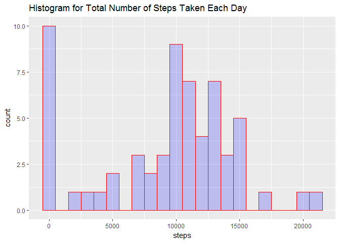
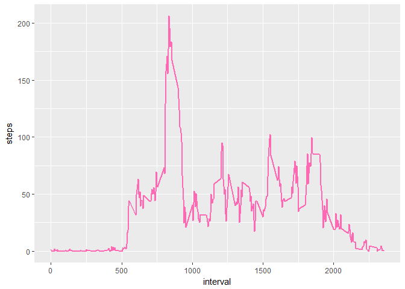
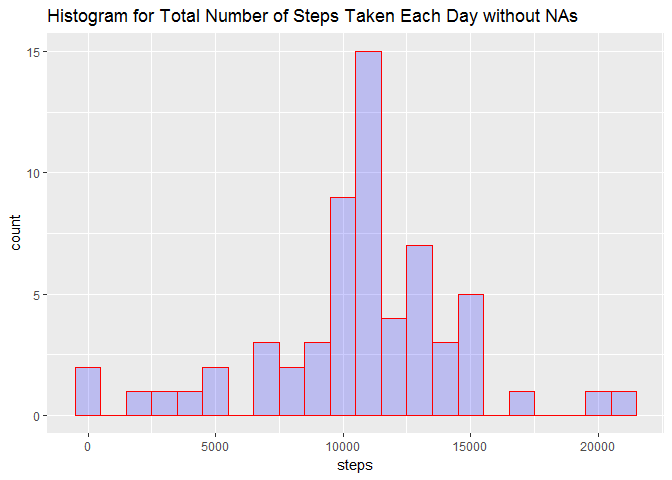
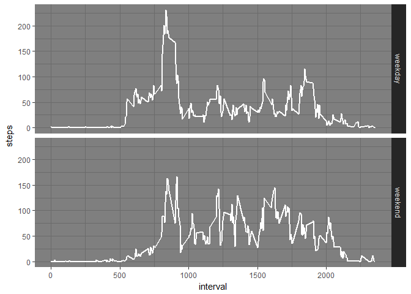

#Analysis of Personal Activity Monitoring Device Data

This data set consists of two months of data from an anonymous individual collected during the months of October and November, 2012 and include the number of steps taken in 5 minute intervals each day.

## Loading and preprocessing the data


```r
library(dplyr)
library(ggplot2)

activity <- read.csv("./activity.csv", header=TRUE, sep =",",na.strings="NA",stringsAsFactors = FALSE)
activity$date <- as.Date(activity$date, "%Y-%m-%d")
```

## Analysis of the total number of steps per taken per day

Here we create a summarized dataset which collapses the data to one observation of total steps taken per day.  Then we take a look at a histogram showing the total number of steps taken each day.


```r
DaySum <- activity %>% group_by(date) %>% summarize(steps = sum(steps,na.rm=TRUE))
qplot(steps,data=DaySum,geom="histogram",binwidth=1000,main="Histogram for Total Number of Steps Taken Each Day", xlab = "steps", fill = I("blue"), col=I("red"),alpha=I(.2))
```

<!-- -->

We can also calculate the mean and median total number of steps taken per day as follows:


```r
mean(DaySum$steps)
```

```
## [1] 9354.23
```

```r
median(DaySum$steps)
```

```
## [1] 10395
```

## Analysis of the average daily activity pattern

To analyze the average daily activity pattern, we can take the average number of steps in each 5 minute interval across all days.  This requires us to summarize the data differently by taking the average for each interval across all days which is shown down below.  After the data is summarized, we want to look at a time series plot of this data.


```r
IntAvg <- activity %>% group_by(interval) %>% summarize(steps = mean(steps,na.rm=TRUE))
ggplot(IntAvg, aes(interval, steps)) + geom_line(color="hotpink",size=1)
```

<!-- -->


Which 5-minute interval, on average across all days in the dataset, contains the maximum number of steps?


```r
order <- order(IntAvg$steps, decreasing = TRUE)
IntAvg[order[1],]
```

```
## # A tibble: 1 x 2
##   interval    steps
##      <int>    <dbl>
## 1      835 206.1698
```

## Imputing missing values

The presence of missing data can introduce bias into some calculations and summaries of data.  Let's take a look at the number of NA values in our dataset.


```r
sapply(activity, function(x) sum(is.na(x)))
```

```
##    steps     date interval 
##     2304        0        0
```

We will now create a new dataset which replaces the NA step values in the original dataeset with the average daily steps taken for that 5 minute interval.  We will achieve this by looping through the dataset and when an NA value is found, we will look up the average daily step count for that interval in our summarized dataset created previously (summarized as the average daily steps by interval, across all days.)


```r
activityNoNA <- activity

for (i in 1:length(activityNoNA$steps)) {
        if (is.na(activityNoNA$steps[i])) {
                activityNoNA$steps[i] <- IntAvg$steps[match(activityNoNA$interval[i],IntAvg$interval)]
        }
}
```

Now lets recreate the same analysis we did earlier on the total number of steps taken each day on the new dataset where we have replaced the missing values.  The following will summarize the data by date, recreate the histogram, and compute the new mean and median to see the impact of imputing missing values.


```r
DaySumNoNA <- activityNoNA %>% group_by(date) %>% summarize(steps = sum(steps,na.rm=TRUE))

qplot(steps,data=DaySumNoNA,geom="histogram",binwidth=1000,main="Histogram for Total Number of Steps Taken Each Day without NAs", xlab = "steps", fill = I("blue"), col=I("red"),alpha=I(.2))
```

<!-- -->

```r
mean(DaySumNoNA$steps)
```

```
## [1] 10766.19
```

```r
median(DaySumNoNA$steps)
```

```
## [1] 10766.19
```

By replacing the missing step values with the daily average in that interval, we can see that the histogram makes more sense as it no longer shows a large frequency for the "0" step value.  Initially, these were not actual observations; instead they were missing values that showed up as a "0" value since we summed the daily steps by setting "na.rm=TRUE".  These false 0 values are potentially misleading.  Additionally, these false values likely skewed our mean too low.  The recalculated mean and median are now the same, while the mean was lower than the median in our previous analysis.

## Are there differences in activity patterns between weekdays and weekends?

Let's take our dataset with imputed missing values and analyze any differences in average steps between weekdays and weekends.  We will first add a new factor variable to our dataset which will indicate whether that day is a weekday or weekend.  Then we will summarize the dataset by calculating the average steps taken for a given interval across weekdays or weekend days.


```r
activityNoNA$dayofweek <- factor(ifelse(weekdays(activityNoNA$date, abbreviate=TRUE) %in% c("Sat","Sun"), "weekend", "weekday"))

IntAvgWeekday <- activityNoNA %>% group_by(interval,dayofweek) %>% summarize(steps = mean(steps))
```

Finally, we will look at a time series panel plot showing the average steps taken in each 5 minute interval, separately for both weekdays and weekend days.


```r
p<-ggplot(IntAvgWeekday, aes(interval, steps)) + geom_line(color="white",size=1) + facet_grid(dayofweek ~ .) + theme_dark()

p
```

<!-- -->
